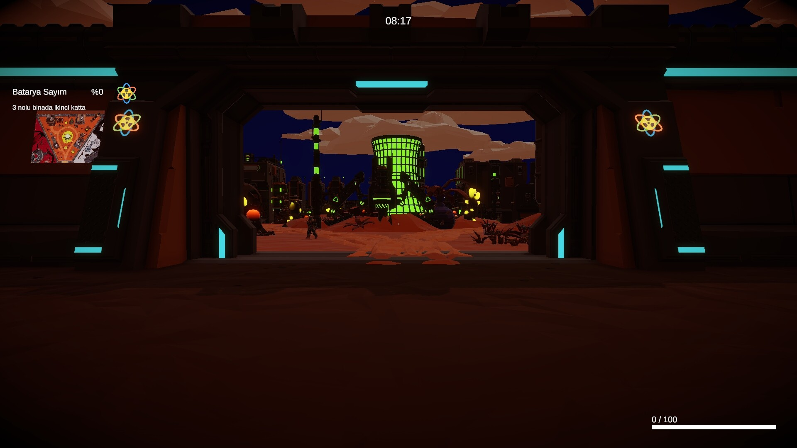
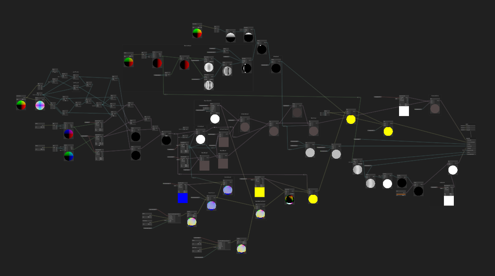
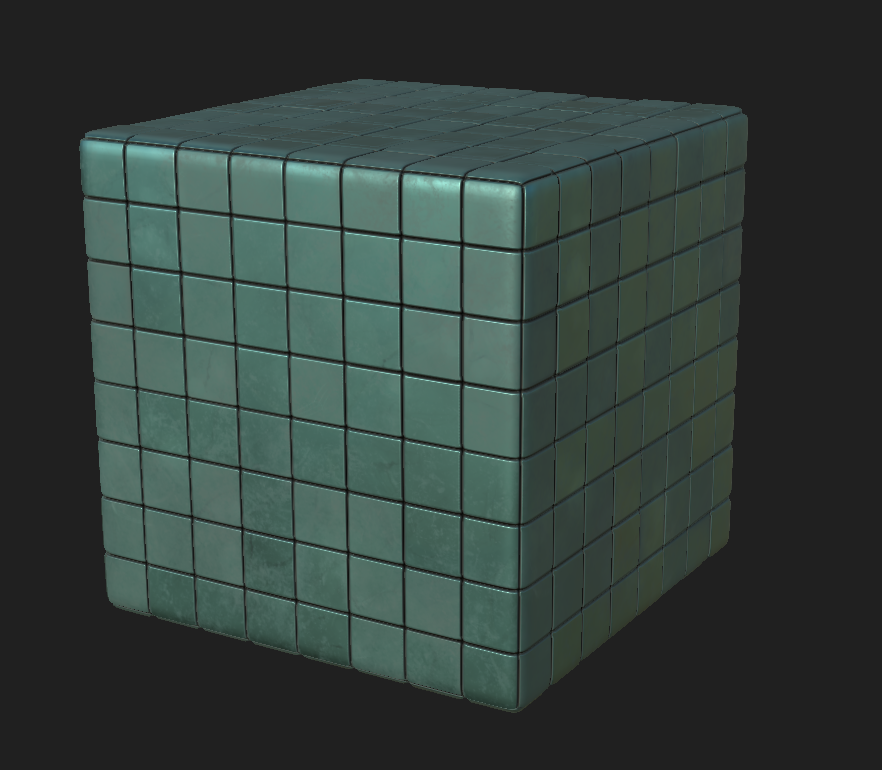
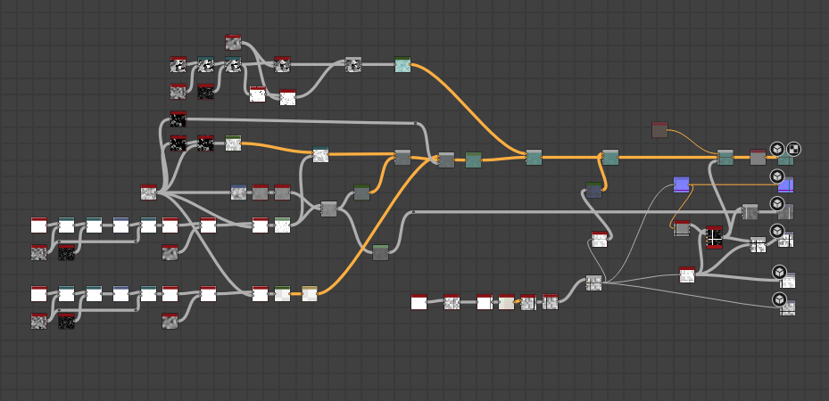

# Area58

**Studio:** The Surveyors Labs  
**Status:** In development — alpha, gathering wishlists  
**Genre:** 1–6 player co-op horror stealth, sci-fi  
**Engine:** Unity 6, URP  
**My role:** Lead 3D Artist + Technical Artist  
**Steam:** [store.steampowered.com/app/4148510](https://store.steampowered.com/app/4148510/Area58/)

A co-op horror stealth-escape game where players complete assigned tasks
each round while secretly planning their escape without raising suspicion.
Built around tension and the fear of losing control.

## Art team

I led two junior 3D artists through the project. Beyond directing the work,
most of my time with them was about performance habits — catching high-poly
models that could be simplified, explaining why draw call count matters in
a multiplayer context, reviewing texture atlasing choices, and building the
kind of instinct for "will this be expensive at runtime" that takes a while
to develop. Both improved significantly over the course of the project.

## How the scope shifted

We started modelling everything from scratch. That proved too ambitious, so
we moved to Synty Polygon assets and the work became level design and
environment assembly — getting spaces readable, atmospherically consistent,
and performant. As the game grew, two things didn't exist that we needed:
a searchlight system and a wet ground shader. I built both. They later
became standalone commercial products on the Unity Asset Store.

## Triplanar shader — Synty to Shader Graph rebuild

Synty's ground shader is generated by Amplify Shader Editor — 3000+ lines
of auto-generated code, repeated eight times for eight render passes, and
impossible to edit directly because any ASE save wipes your changes. I
rebuilt the entire shader in Unity Shader Graph to gain full control, then
merged the wet ground system on top.

The tricky parts:

**Four-face cylindrical triplanar.** Synty's triplanar samples four faces
(top, bottom, side X, side Z) rather than the standard three. Bottom faces
needed to sample a different texture than the top. This required splitting
the surface normal's Y axis into separate positive and negative values and
running them through the blend calculation independently. The standard
Shader Graph triplanar node can't do this — it had to be built manually.

**The epsilon fix.** The blend weights are calculated by raising the surface
normal to a high power, which produces extremely tiny floating point values
across most of the surface. Dividing those tiny numbers by each other to
normalize them caused GPU precision errors — the result was a blurry
rectangular patch instead of a clean round cap. Adding `0.00001` to the
denominator kept the math stable. The original Synty shader had this fix
in their source; finding it meant reading the actual .shader file rather
than relying on documentation.

**RNM normal blending.** Shader Graph's built-in triplanar blends normal
maps using Whiteout blending, which pinches at the seams between faces.
Synty's original used Reoriented Normal Mapping (RNM) which handles the
transition correctly. I implemented this as a Custom Function HLSL node
taken directly from the original shader source.

**Magio Pro compatibility.** The rebuilt shader exposes `_WetnessAmount`,
`_DissolveAmount`, and `_OverlayAmount` as float properties so Magio Pro
can drive wetness, dissolve, and overlay effects across the material without
knowing anything about the shader internals.

## Wet ground shader

Dual Gradient Noise puddle mask, procedural rain ripples, and surface
darkening tied to a wetness float. Built for Area58's outdoor environments
and later released as part of the Low Poly Wet Surfaces commercial asset.

## Searchlight System

Rotating beams with VFX Graph volumetric cones and soft depth-buffer
intersection with scene geometry. Job System parallelism keeps the CPU
cost flat regardless of how many lights are active. Also released as a
standalone commercial asset.

## Lab wall — unused

A lab interior wall material built during an earlier art direction.
Tileable panels with seam grime and edge wear, intended for the lab
environments before the look of the game shifted. The art direction moved
elsewhere and the material never made it into the shipping scenes.

---

_Steam page: [store.steampowered.com/app/4148510/Area58](https://store.steampowered.com/app/4148510/Area58/)_  
_Wishlist if you want to follow development._
