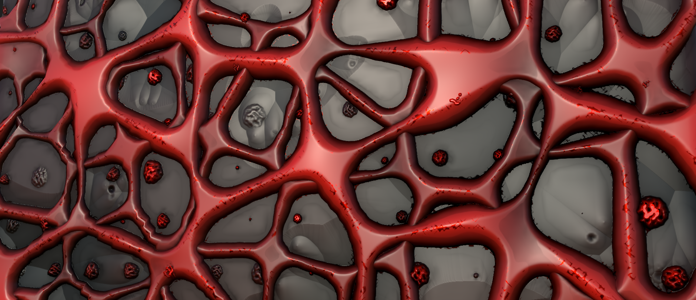
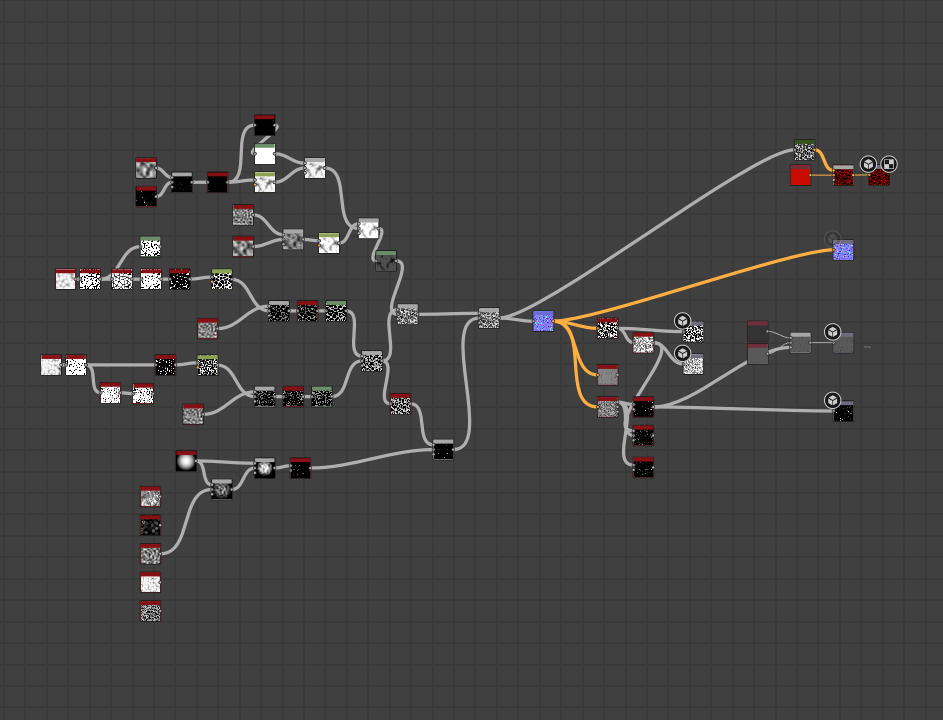
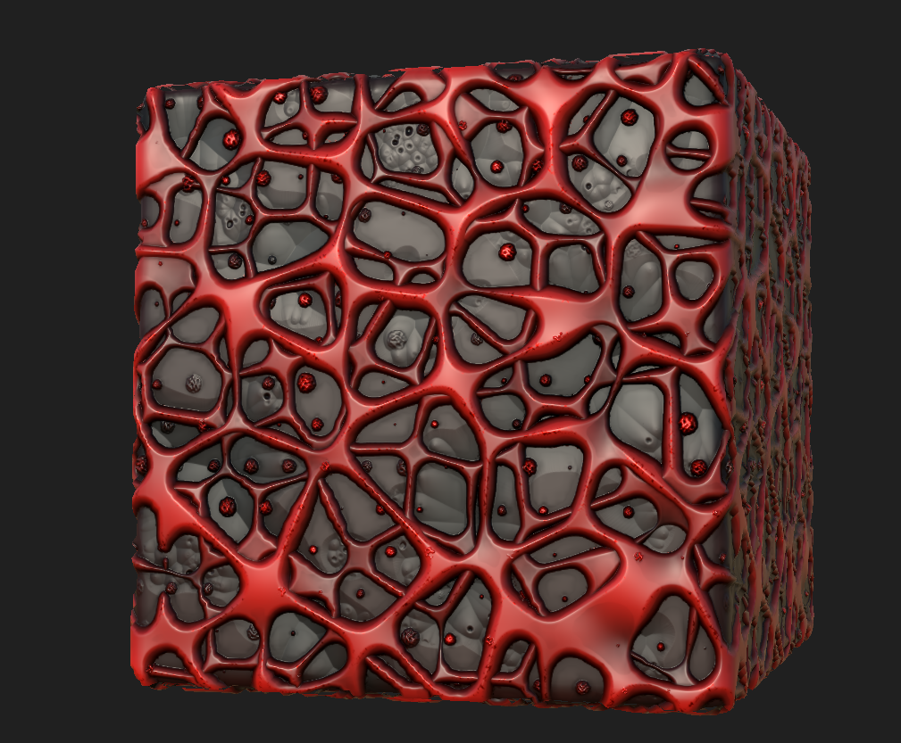

# Fantasy Grand Strategy — Game Art

**Status:** In progress — long-term passion project
**Genre:** Grand strategy (EU4 / CK3 inspired), fantasy setting with multiple playable races — dwarves and others being developed
**Engine:** Unity 6, URP 17.2
**Tools:** Gaea, Blender, Substance Designer, Unity
**My role:** Art across the project — terrain, environment, models, materials, shading and integration
**Map foundation:** World Map Strategy Kit 2 (Kronnect) — bought; provides borders, political layers, pathfinding, fog of war out of the box

A collaborative fantasy grand strategy game in development. The map
rendering itself is a paid asset, which lets the rest of us focus on
what makes _this_ game look like itself — the races, the terrain, the
architecture. That side has grown well past "map-shader work" since I
joined; I'm on the broader art problem now, not just the map.

## What I'm doing across the project

- **Terrain in Gaea** — heightmaps and erosion passes for regions that
  need a distinctive look at map scale.
- **Models in Blender** — assets and props for the playable factions.
- **Materials in Substance Designer** — race-distinctive ground and
  architecture textures, exported as PBR sets.
- **Unity URP integration** — bringing everything in, custom shaders
  where the URP Lit shader isn't enough, lighting and atmosphere.

Each race has to read as itself at map zoom-out and still hold up when
the camera comes in closer. That's the design constraint everything
answers to.

## First finished material — Dwarf base

The dwarves are the first race I took a full material through to
completion. They're an iron-working race living on iron-rich land.
Their walls and infrastructure are affected by a mushroom-like disease
that gathers across surfaces, sends out red mycelial connections, and
slowly destroys the land it spreads through. The material has to read
as two things at once — industrial iron-working craftsmanship and an
organic biological infection running through it.

**Direction from the writer (translated):**

> Architecture: Art Nouveau in the Antoni Gaudí tradition, Soviet
> Constructivism, and — for the Barzar walls — iron walls woven into
> vine shapes alongside dead reefs.
>
> Biological: H. R. Giger's drawings can be drawn on as reference.

I kept the silhouette and motifs recognisably dwarven rather than
literally biomechanical — Giger's language of ribbed organic forms and
dark bone-like structures, but running through molten iron and mycelium
instead of bone and chitin. The base ground material is built on those
two ingredients: iron that reads as poured and partially cooled, and
mycelial growth threading through it.

Built in Substance Designer and exported as a PBR texture set
(BaseColor, Normal, Roughness, Metallic, AO, Height) applied via the
URP Lit shader. The viewer above is the same Substance output running
on three.js with PBR lighting; drag to orbit, switch shape, vary tile
density.

