# 5th-century Mesopotamia Base

**Year:** 2024
**Engine:** Unreal Engine 5 (Nanite)
**Context:** Final project for an environment-art bootcamp for Unreal

A bootcamp focused on environment art for Unreal — block-out techniques,
style direction, materials, camera animation, scene composition, and
Nanite. There were Blender lessons in the curriculum too, but I was
already comfortable in Blender at that point so I skipped lightly over
those.

The brief for the final project was open. I went for an **XCOM-style
strategy-base scene set in 5th-century central Mesopotamia** — the same
gameplay role as XCOM's Avenger: a place the player visits between
missions to give commands, upgrade equipment, and pick soldiers. The
design problem was making 5th-century Mesopotamia read as a _blend_ of
the cultures that lived there while still feeling like one coherent
space.

## The brief I set

The map-base scene in XCOM is doing real gameplay work — it has to feel
like a command center, hold the player's attention between missions,
and visually rank the things the player can interact with. I wanted the
Mesopotamia version to do the same thing: not a museum diorama, a
working room with seats of decision in it.

## Inspirations

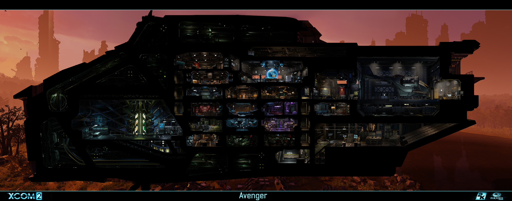

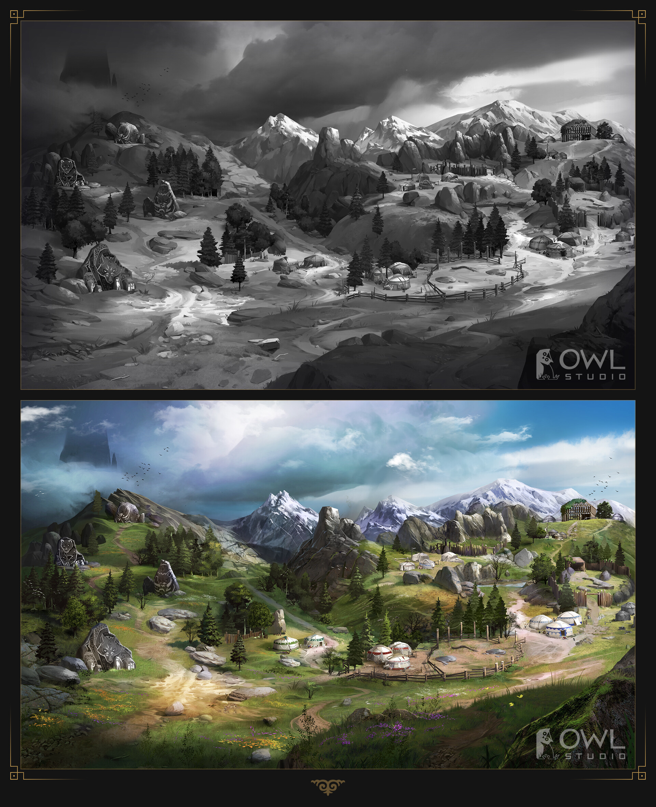

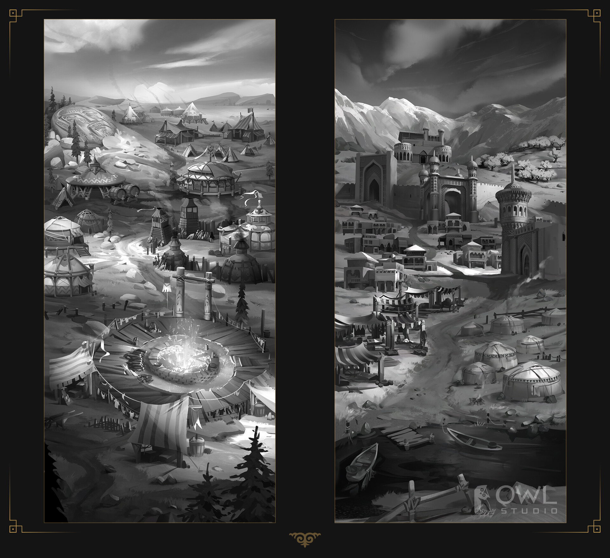

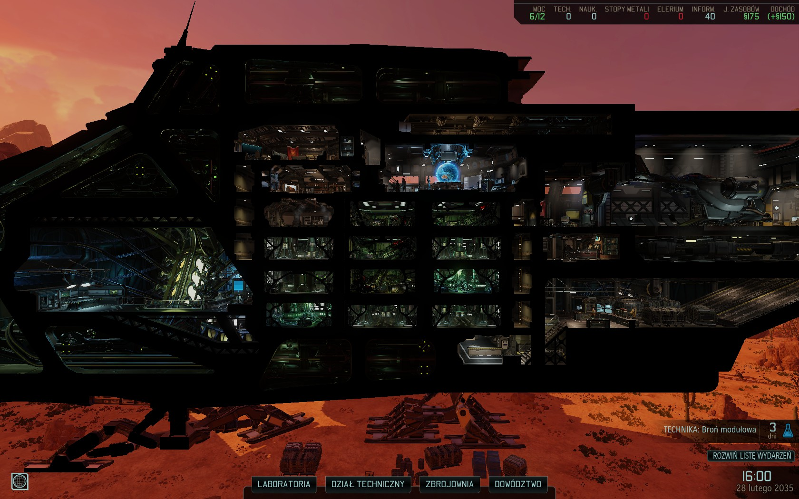

XCOM's Avenger for the _role_ the room plays, Owl Studio's Sultan
project for the kind of Near-Eastern architectural language I wanted,
and period references for the cultural-blend details.

## Progress

The pass below is the rough chronological order of the block-out and
look-development as it came together over the bootcamp:

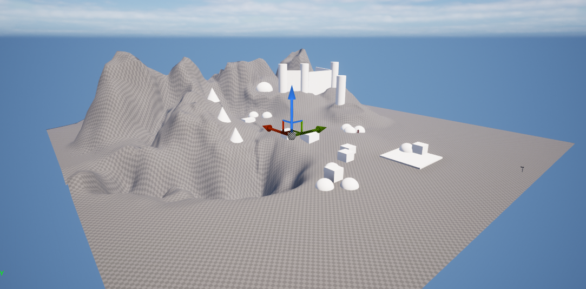

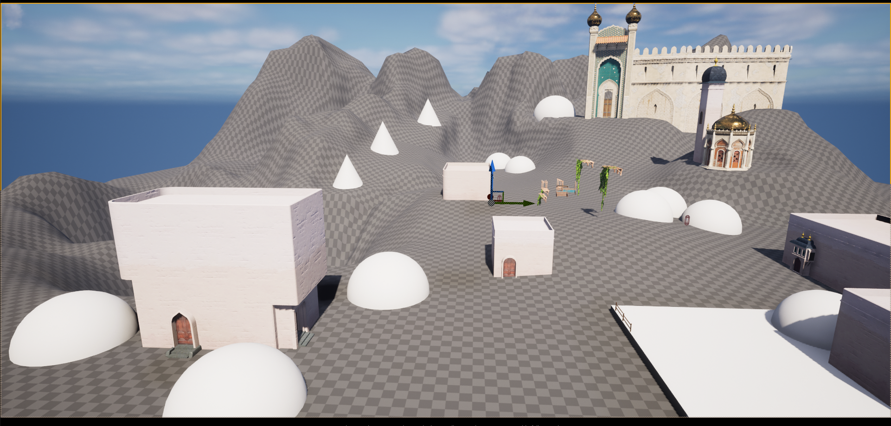

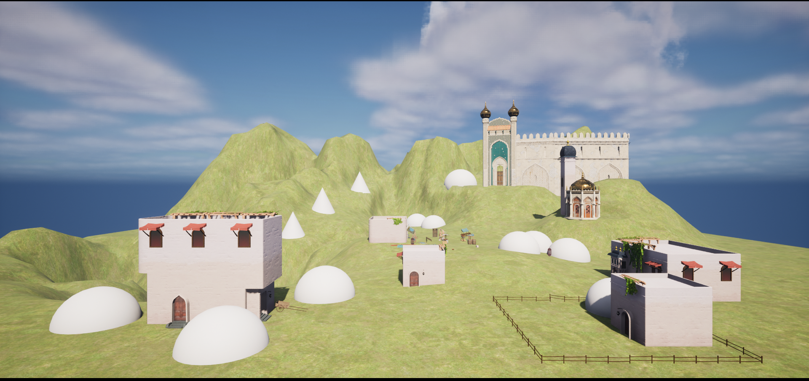

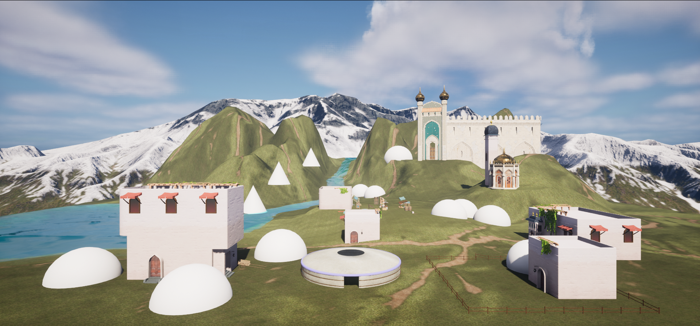

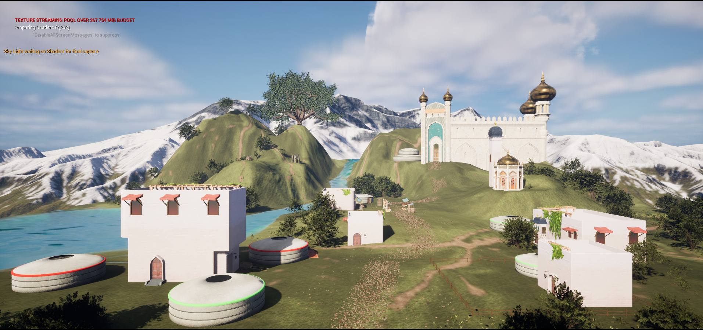

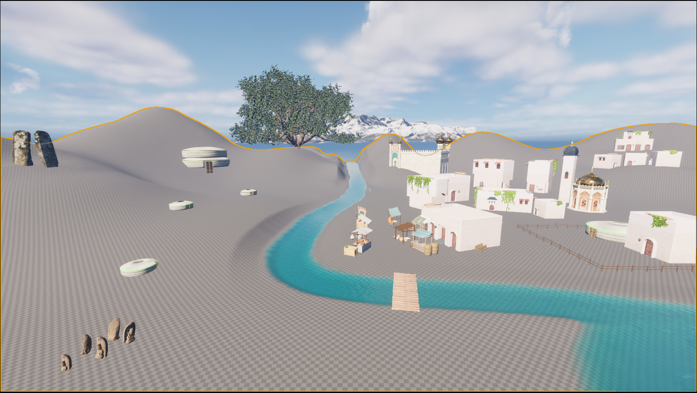

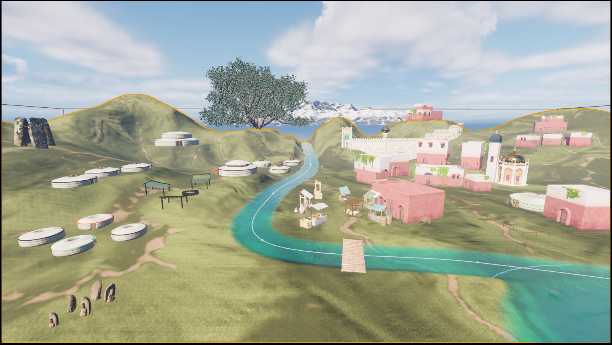

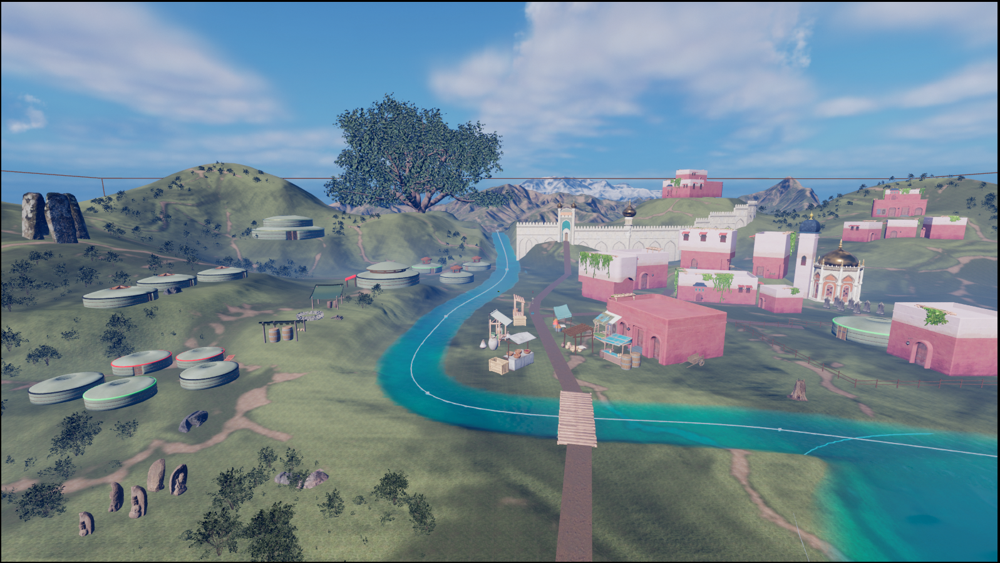

## What I took away

- Block-out first, materials last — and _protect_ the block-out across
  the whole project. Almost every problem in the middle passes was a
  silhouette problem that should have been solved earlier.
- Nanite changes what's worth modeling at high density. The decision is
  no longer "can the engine handle this geometry" — it's "does this
  geometry earn the screen time."
- Designing a scene around a _gameplay role_ (command center) gives you
  a sharper composition test than designing around a _period_
  (Mesopotamia). The period decorates; the role decides what's hero and
  what's set dressing.
