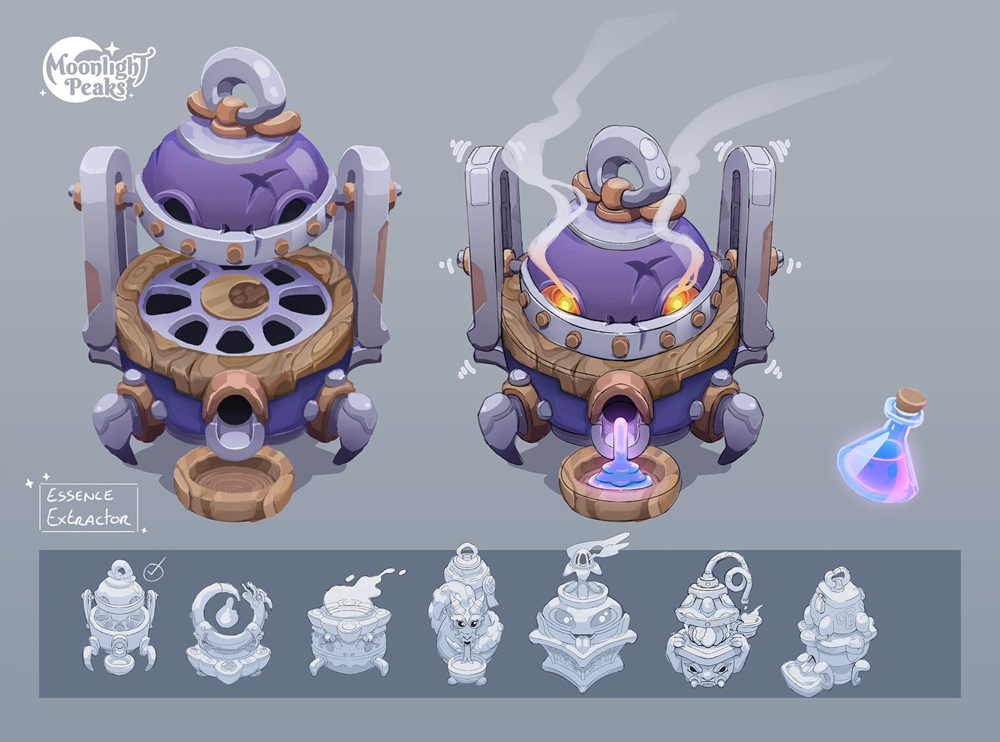
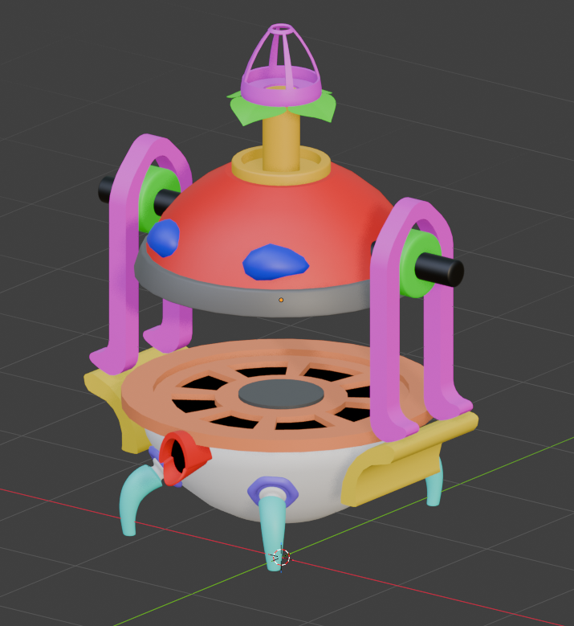
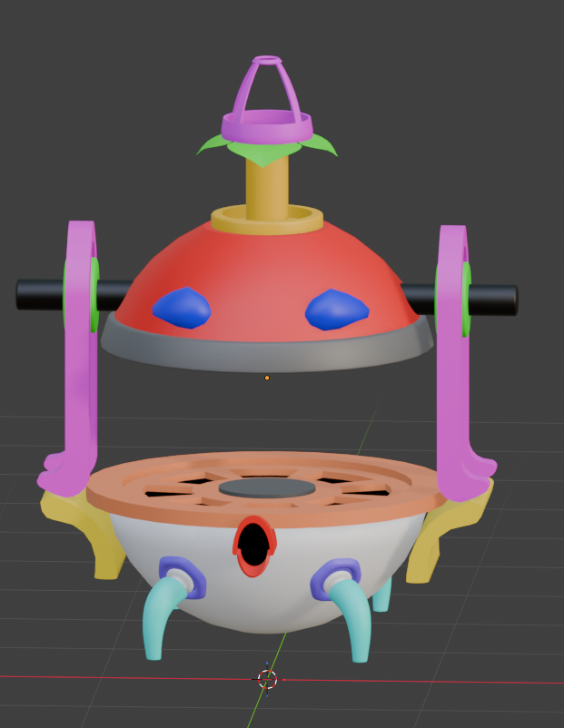
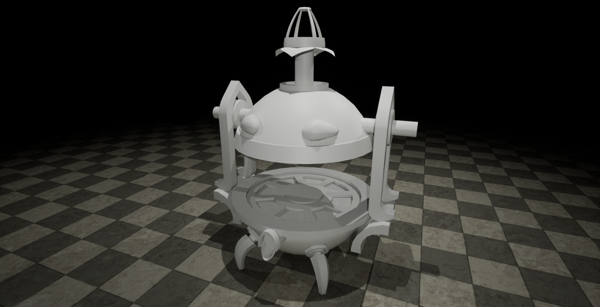

# Moonlight Peaks Censer

**Event:** Polycount bi-monthly environment art challenge — Nov/Dec, round 93
**Theme:** _Moonlight Peaks_ prop designs by Daphne Fontijn
**Status:** Left unfinished — low-poly done, high-poly and texturing not started
**Thread:** [polycount.com/discussion/236215](https://polycount.com/discussion/236215/the-bi-monthly-environment-art-challenge-november-december-93)

My first time joining a Polycount challenge. The brief was to pick one of the
provided concept artists and build a piece from their sheets. I went with
Daphne Fontijn's _Moonlight Peaks_ prop designs and chose a censer-burner —
then took the liberty of mixing elements from several of her variants into a
single design instead of replicating one sheet exactly.

## What got done

The low-poly model is complete. Silhouette, proportions, and overall
structure are where I want them. The base, the burner body, and the
chain attachment points all came out close to the merged-reference
design. The viewer below is the live model — drag to orbit, toggle
wireframe to see the topology.

The last two images are the latest pass — geometry was finalised and
material slots were assigned, ready to take into Substance Painter. That's
where the work stopped.

## The legs

The legs are the one part I'm not happy with. I tried a few variations and
couldn't land on a shape that read well against the rest of the silhouette,
so they're sitting at a basic placeholder until I find something better. The
honest version of this is in my thread comment too — I'd rather flag it than
pretend the prop is finished.

## Final low-poly render

## Why it paused

A paid commission (the [World Warriors](/projects/world-warriors) fire-awareness
project) came in shortly after the low-poly was done and took priority. By the
time that finished, the bi-monthly window had closed and the piece sat on the
back burner.

It's a project I want to come back to — there's a clear next step (high-poly
sculpt → bake → Substance Painter pass) and the planning is already done.
Picking it back up is just a matter of carving out the time.

---

_Polycount thread: [polycount.com/discussion/236215](https://polycount.com/discussion/236215/the-bi-monthly-environment-art-challenge-november-december-93)_
