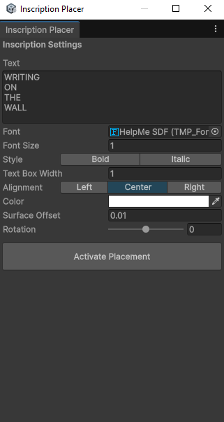
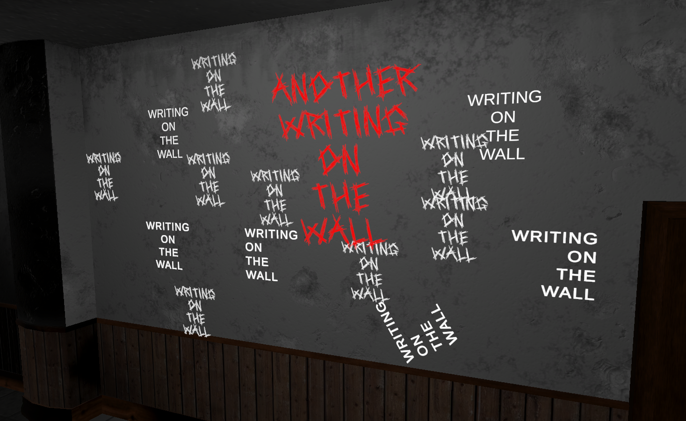

# Surface Text Placer

**Status:** Submitted — Unity Asset Store ($4.99)  
**Engine:** Unity 6, URP  
**Category:** Tools > Level Design

An editor tool for placing TextMeshPro 3D text on flat surfaces from the
Scene view. Activate the tool, click a surface, type your text. The
inscription appears at that point oriented to the surface normal and parented
to the object so it moves with it.

The closest competitor charges $39 for a decal-only, runtime-focused version.
This tool uses real TMP 3D geometry — receives scene lighting, needs no
decal receiver setup — and is built around the editor click-to-place workflow
that nothing else on the store does well.

<iframe width="100%" height="400" src="https://www.youtube.com/embed/TnYMkSeLcdQ" frameborder="0" allowfullscreen></iframe>

## The extrusion detour

The original plan included extruded 3D text — letters with actual depth.
This was partially built: front and back faces worked, but the sides came
out as rectangular blocks instead of letter shapes.

The reason is how TMP works. TMP uses Signed Distance Field rendering —
letter shapes are computed in the shader from a distance field texture,
not stored as mesh geometry. The actual mesh is one quad per character
regardless of the letter. Extruding that gives rectangular boxes. Getting
real letter-shaped extrusion would mean reading bezier curves from the font
file, tessellating them, and building geometry from the outlines — weeks of
work for a $5 tool.

The decision was to drop extrusion and focus entirely on the placement
workflow, which is the part no other tool handles.

## Technical problems solved

**Alignment buttons.** Initial implementation used Toggle nodes, which
evaluate every frame — whichever button ran last won, making it impossible
to select Left alignment because Center and Right evaluated after it. Fixed
by switching to Buttons, which only fire on click.

**Deprecated API.** `enableWordWrapping` is removed in Unity 6. Replaced
with `textWrappingMode = TextWrappingModes.NoWrap`.

**Inspector updates not refreshing.** Font size, color, and alignment changes
weren't updating immediately in Scene view. `ForceMeshUpdate()` alone wasn't
enough — `EditorUtility.SetDirty()` on the TMP component was also required
to force an immediate repaint.

**Rotation save bug.** The Reset button wasn't restoring rotation correctly
when users had rotated inscriptions with Unity's own rotate gizmo rather than
the Inspector slider. The slider value and the actual transform rotation had
drifted apart. The fix was reading the actual transform rotation in
`SaveCurrentPosition`, computing the difference against the base orientation
derived from the stored surface normal, and saving that angle — so rotation
applied by any method gets captured correctly.

**Local space storage.** Position and surface normal are stored in the parent
object's local space, not world space. World space coordinates go stale the
moment the parent moves. Converting back to world space at reset time means
the inscription always returns to the correct spot on its surface regardless
of where the parent has moved.

## What I learned

Unity Editor scripting from the ground up — `EditorWindow`, `CustomEditor`,
`SceneView.duringSceneGui`, `HandleUtility`, and the `Undo` system.
`Physics.Raycast` in an editor tool context rather than gameplay.
`Quaternion.LookRotation` for surface orientation — understanding forward
and up vectors in a practical placement scenario. The difference between
world space and local space made concrete by the Reset button. `EditorPrefs`
for cross-session persistence. When `ForceMeshUpdate` alone is not enough
and why `SetDirty` is also needed.
