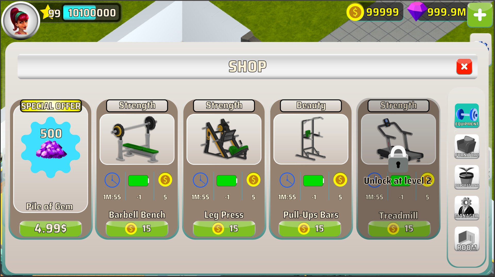
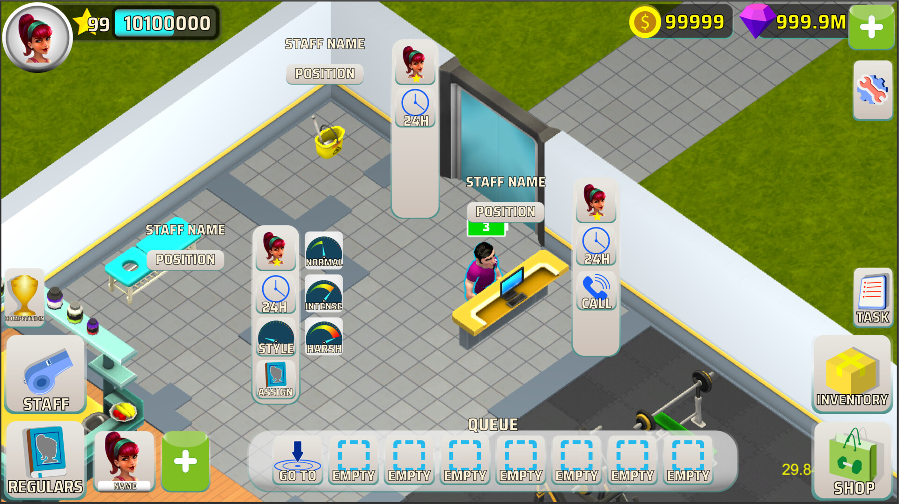
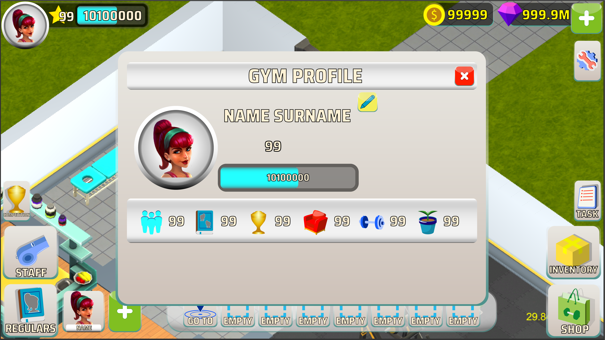

# Gym Simulator — UI Internship at Toxicality

**Year:** September–November 2019
**Studio:** Toxicality — indie studio, Sofia, Bulgaria
**Platform:** Android
**Role:** UI design intern
**Programme:** AIESEC student exchange

My first job at an indie studio, my first time working abroad, and the
required internship for my graphic design degree. AIESEC arranged the
placement and I spent September through November in Sofia working on UI for
Toxicality's Android gym simulator.

## What the work was

By the time I arrived, the game was essentially art-complete except for
the UI. That inverted the usual brief — instead of UI being one piece in
an evolving art direction, the visual language was already locked, and my
job was to make the UI fit a finished aesthetic rather than help define
one.

The first few days were the hard part. The screens I produced from scratch
didn't sit right alongside the existing art — wrong weight, wrong
texture, wrong palette feel. Iteration was the answer: study what was
already in the game, match the conventions it had already established,
then design within those constraints. By the end of the first week the
UI was starting to read as part of the same product, and from there the
remaining screens came together quickly. I finished the full UI pass
ahead of the allocated time.

## The work–life balance lesson

The most useful non-design takeaway from the internship had nothing to do
with UI. The first couple of weeks I was staying late and pushing through
evenings to deliver faster. The studio owners pulled me aside and gave me
what I'd now recognise as a fairly important reality check — there was no
race, the schedule was reasonable, and burning out to deliver early
wasn't what they were asking for.

It was the first time anyone in a professional setting had told me to
slow down on purpose, and it stuck. I shipped on time, with weekends
intact, and the work was better for it.

## What I took from it

- The discipline of designing into an existing visual language rather
  than imposing my own.
- A first concrete sense of how indie studios actually operate day to day
  — short feedback loops, small teams, decisions made in the same room.
- A working baseline for the abroad experience side of things: living
  somewhere new, navigating a different language and city, getting useful
  work done on a deadline.
- The work–life balance reset, which has stayed with me.

It was a short internship and a small game, but it was the project that
turned graphic design from a degree subject into something I'd done as
real work for a real client.
