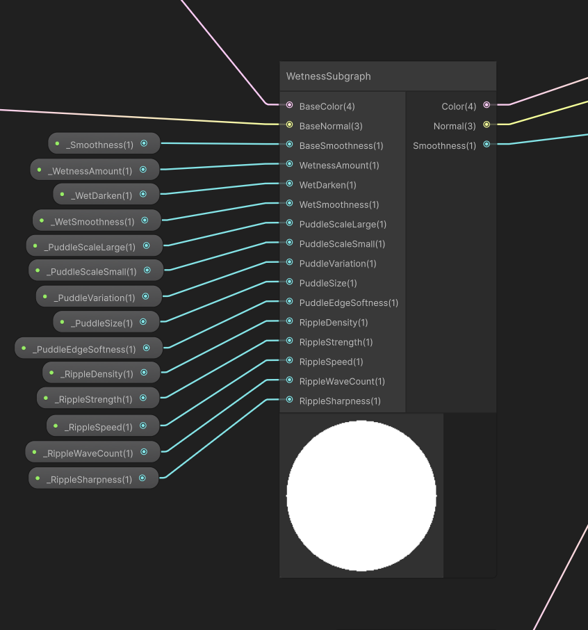
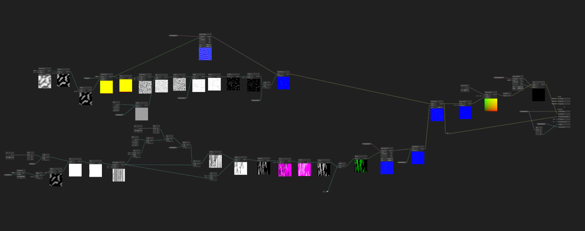

# Low Poly Wet Surfaces

**Status:** In Progress — trail system still being refined  
**Engine:** Unity 6, URP 17.2, Shader Graph + HLSL  
**Planned price:** $15–20

A wetness shader system built around a reusable subgraph. The core product
is a `WetnessSubgraph` — takes BaseColor, BaseNormal, and BaseSmoothness as
inputs and returns wet-adjusted versions. Anyone can drop it into their own
shader without touching the internals. `WetSurface_Lit` ships as a ready-made
URP Lit replacement that uses it.

One thing learned early: subgraph inputs don't automatically appear in the
material inspector. You need matching properties on the parent shader's
blackboard wired into the subgraph node — they don't connect themselves.

<iframe width="100%" height="400" src="https://www.youtube.com/embed/mF6WJXX8vso" frameborder="0" allowfullscreen></iframe>

## Puddle system

Procedural puddle shapes from two layered Gradient Noise nodes (large scale
and small scale) multiplied together, then Smoothstepped for organic edges.
World-space XZ projection keeps puddles fixed in space regardless of mesh UVs.

A surface angle mask limits puddles to upward-facing surfaces — Normal Vector
(World) → Split.G → Saturate → Smoothstep. Without this, the world-space XZ
projection samples a 1D slice of the noise on vertical surfaces and puddles
appear as horizontal stripes on walls. The noise was correct; the projection
direction needed filtering.

One `WetMask` (PuddleMask × WetnessAmount) drives three things simultaneously:
base colour lerps toward a darkened version, smoothness shifts from rough to
glossy, and normals lerp toward flat — the water surface suppresses surface
detail. Three visible changes from one value.

## Rain ripple shader

Fully procedural — no textures. Built as a Custom Function HLSL node using
Cyanilux's technique.

The algorithm divides the surface into a grid of cells. Each cell gets a
randomly placed raindrop origin with a random time offset so rings don't
pulse in sync. Each pixel checks its own cell plus the 8 surrounding cells
in a 3×3 loop so ripples overlap naturally at boundaries.

The ripple math combines four things in one expression: distance falloff,
a time-visibility mask for sharp thin rings, a sine wave for concentric
circles, and a strength multiplier. Understanding how those multiply together
to produce the visual was the main learning moment.

Two problems solved during development: ripples bleeding past their cell
boundary (fixed with a distance cutoff — if the ripple has expanded too far,
skip it) and the strength parameter having no effect (the original code
normalised the normal vector at the end, making it unit-length regardless of
the strength applied to XY — fixed by applying strength before normalising).

Parameters exposed: density, strength, speed, wave count, sharpness. Wave
count and sharpness were hardcoded in the original technique; exposing them
as user controls was a deliberate addition.

## Window rain shader

A different approach to the ground ripple system. Instead of computing drop
paths in code, the drops and trails come from a raindrop hemisphere normal
map with animated UV scrolling. The UV motion creates the appearance of drops
sliding and leaving trails without any path simulation.

**Refraction** — the Scene Color node sampled with an offset Screen Position.
Drop normals shift the UV so the view through the glass warps where drops sit.

**Texture overlay** — a `_WindowTexture` slot for layering dirt, grime, blood,
or stained glass on the surface. Blended using the texture's alpha channel —
empty slot is pure glass, painted areas composite on top.

A classic Unity gotcha appeared early: the normal map was showing square cell
boundaries instead of smooth drops. The fix was setting the texture import
type to Normal Map in the Unity Inspector — without this Unity doesn't unpack
the normal channels correctly and the whole thing breaks.

This shader was harder than expected. Pure Shader Graph nodes produced flowing
water rather than individual drops. A custom HLSL trail attempt didn't produce
convincing results. The texture-based approach from Cyanilux was what finally
worked. Not everything needs to be procedural — a well-animated texture
sometimes beats complex math.

## Current state

The puddle system and rain ripple shader are working well. The window rain
trail system — how drops slide and leave streaks — isn't where it needs to
be yet. The movement reads as animated texture rather than convincing physics.
Still being worked on before the asset goes to the store.

---

_Rain ripple technique credit: [Cyanilux](https://cyanilux.com)_
