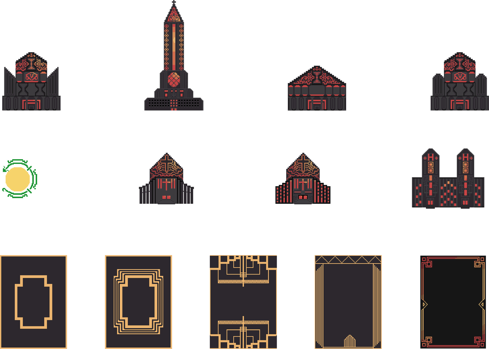

# What Comes After

**Event:** Global Game Jam 2020  
**Team size:** 7  
**My role:** Artist  
**Format:** Board game + mobile game

<iframe width="100%" height="400" src="https://www.youtube.com/embed/oFYDAseDv1Q" frameborder="0" allowfullscreen></iframe>

## The concept

Two games, played at the same time. One is a physical board game, the other
is a mobile game — and they're connected. When a player takes a piece on the
board, they take the same piece in the mobile game. The two halves can't be
played independently; each move in one affects the other.

The mobile side worked like a constrained Tetris. Players received pieces in
random order and had to fill the outline of a building within a limited number
of moves and a time limit. The shape of the building was fixed; the order the
pieces arrived was not.

## Art direction

The game is set in a dystopian world in the vein of 1984 — centralized power,
controlled populations, architectural grandeur used as a symbol of authority.
The visual style was Art Deco with a tyrannical twist: the ornate geometry and
geometric precision of Art Deco, drained of warmth and pushed into the palette
of oppression. Muted, authoritarian colours — the kind that look like they
were chosen by a committee that didn't want anyone to feel too comfortable.

## Context

Built in 48 hours as part of Global Game Jam 2020. Seven people, one weekend,
a concept that required designing two separate game systems that interlocked.
The dual-medium format was the design challenge — making the physical and
digital halves feel like one game rather than two separate things that
happened to run at the same time.
