# World Warriors

**Status:** Cancelled (early 2025)
**Client:** Government office — fire-awareness campaign
**Engine:** Unity 6, URP, Shader Graph
**My role:** Material and shader work

A commissioned project for a government office working on a public fire-awareness piece. The team reached me through personal contacts. The project was eventually cancelled, but the scope was narrow enough — a handful of scenes, no streaming, no large open environments — that performance was effectively a non-concern. That gave me room to push every material as far as it could go.

The workflow was repetitive in a good way: find a credible tutorial for the look I needed, follow it through, then strip it down and rebuild it to fit the project's art direction. Almost every material on this page was built that way — tutorial first, then edited until it stopped looking like the tutorial.

## Damaged wall

The main hero material — broken plaster over a cement substrate, dirt and edge wear, varied normal detail.

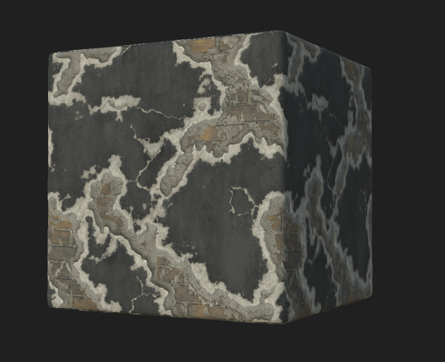

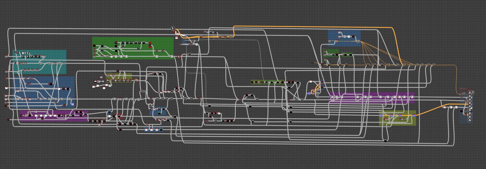

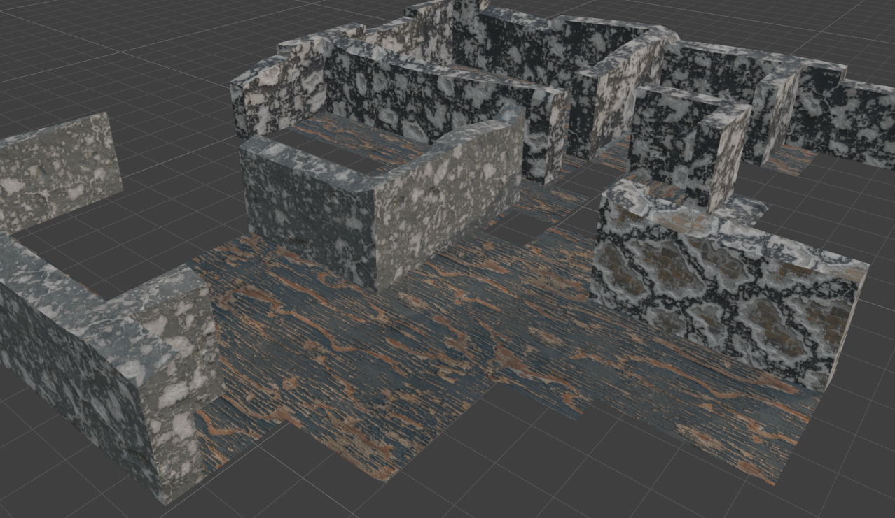

### Modular inner-layer variant

The interesting variant. The cement is the outer layer; what's visible inside the broken-out areas is normally baked into the graph. I left those end nodes open instead — the inside material becomes an input slot rather than a wired-in texture. Drop in brick, a different brick pattern, wood planks, or rebar and the same wall now reads as a completely different construction without rebuilding the shader. One graph, many wall types depending on what got slotted in.

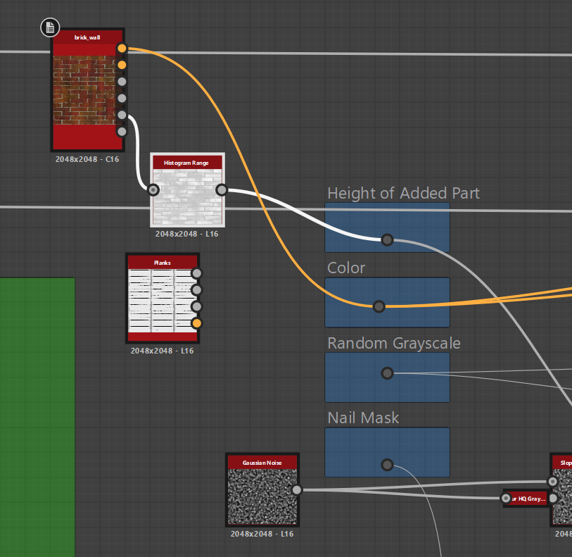

## Cement

The substrate material used underneath the damaged wall, also usable on its own for floors and bases.

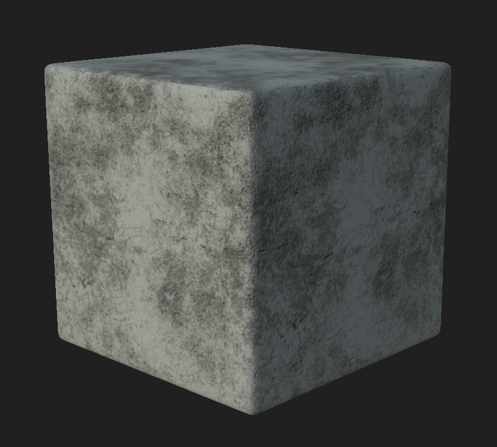

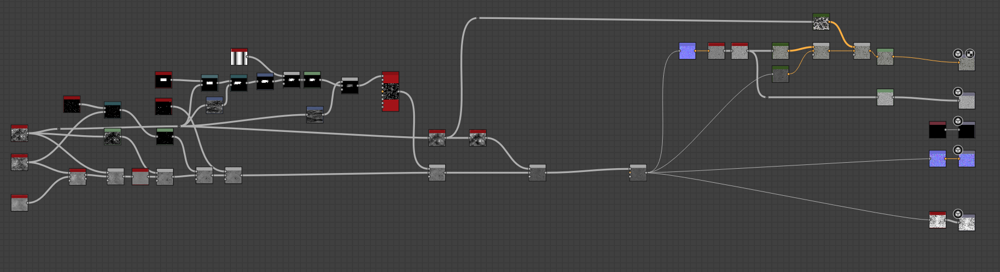

## Ground

A general dirt/ground material for outdoor surfaces.

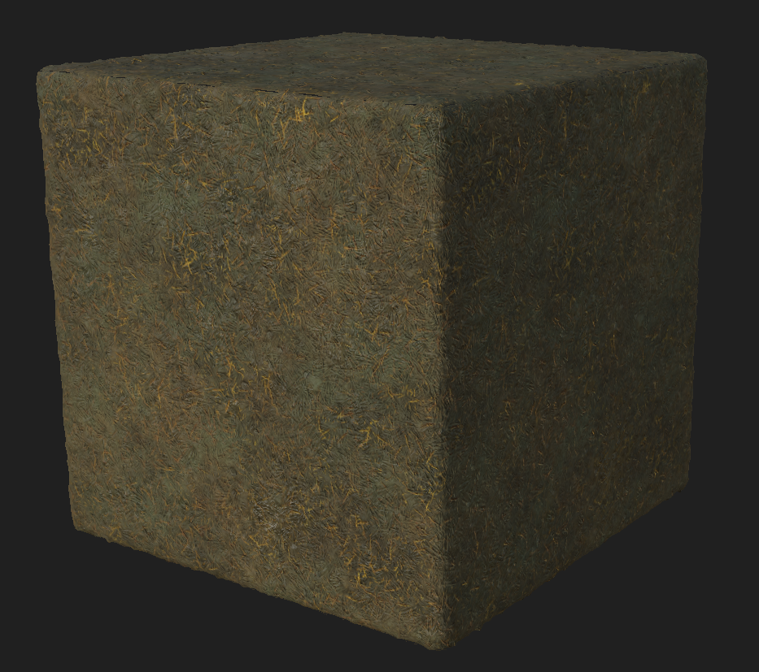

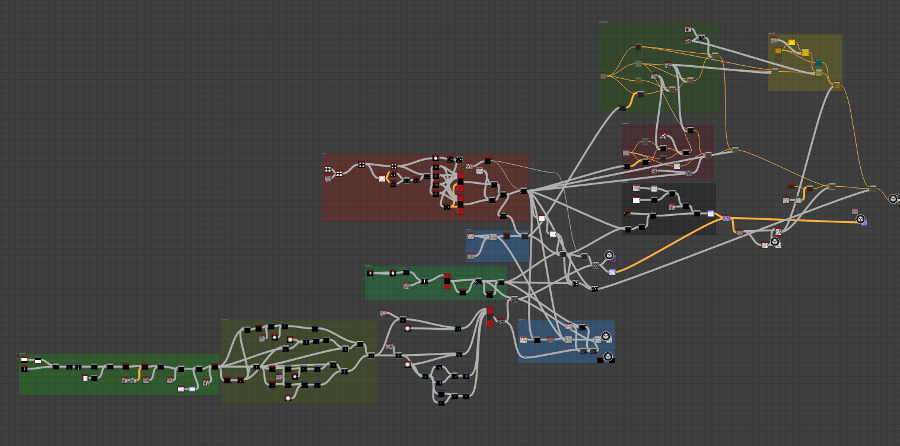

## Grass ground

Layered grass on top of the ground base — height-blended, with separate normal and roughness handling for the grass strands.

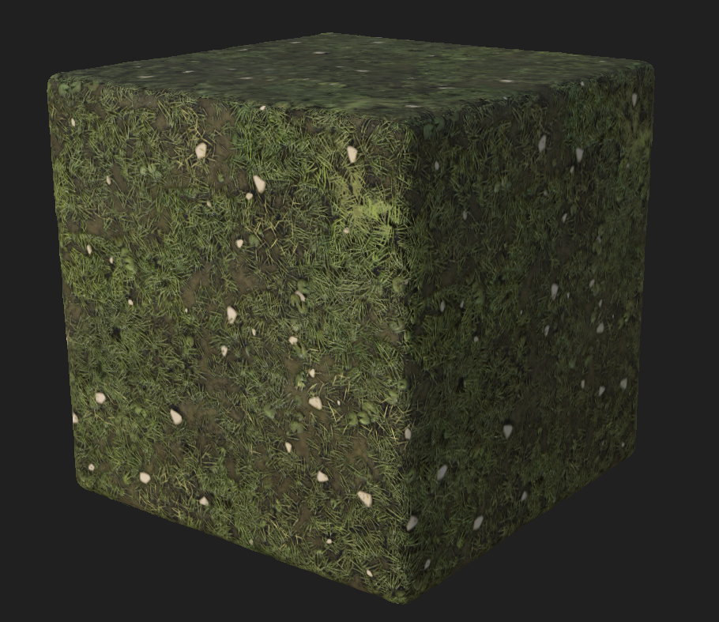

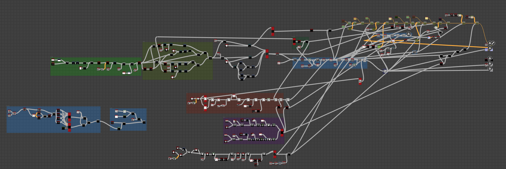

## Asphalt

Road and paved-surface material.

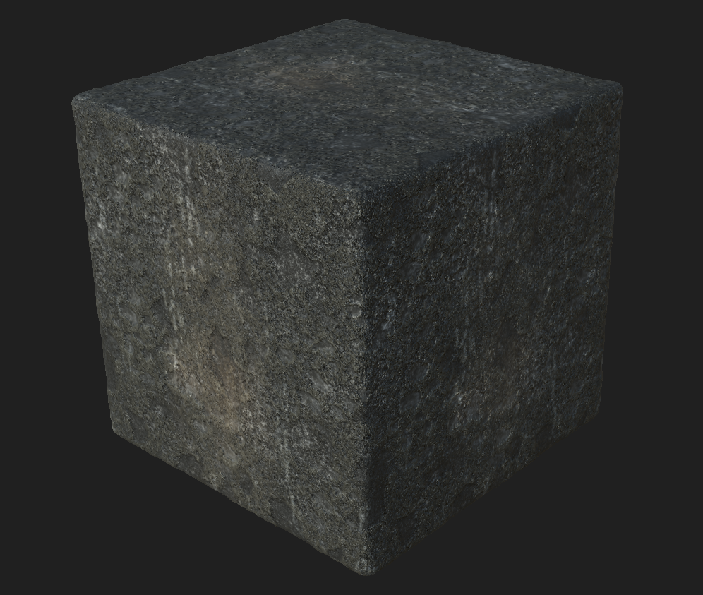

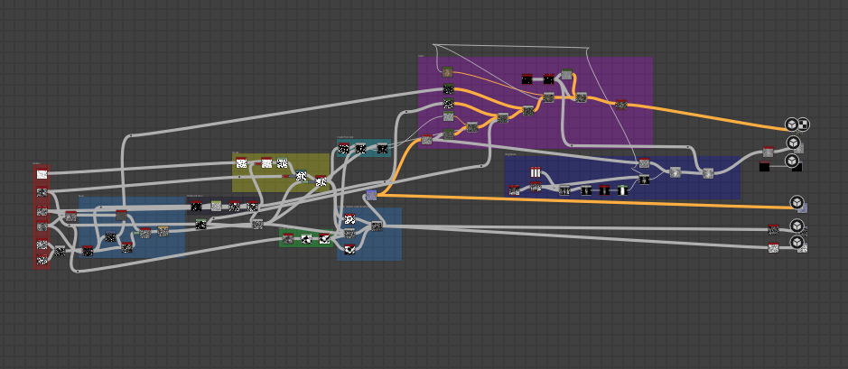

## Rusted panel

Metal panel with rust, edge wear, and weathering for industrial set dressing.

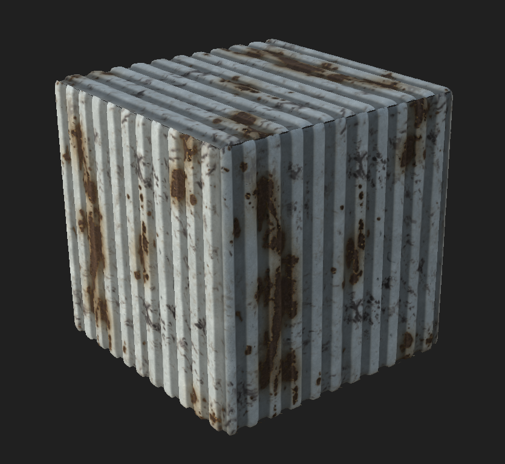

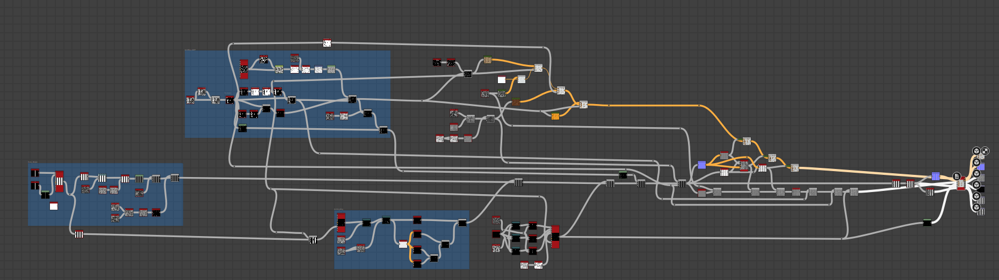

## Takeaway

The cancellation was disappointing but the work paid off as a portfolio of finished, high-detail material setups across very different surface types — plaster, cement, dirt, grass, asphalt, weathered metal. Working at high quality without a performance ceiling was a useful exercise in itself; it made the constraints on later projects easier to reason about, because I had a concrete sense of what "expensive but pretty" actually looks like in Shader Graph.
